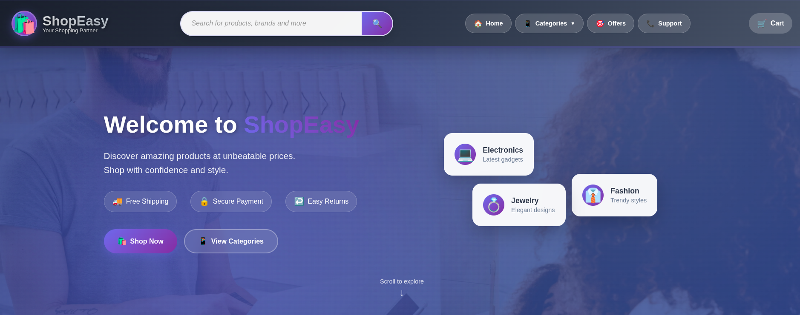
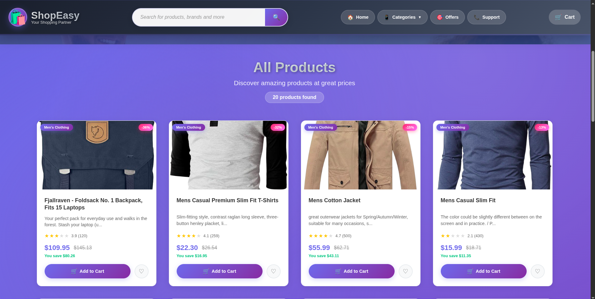
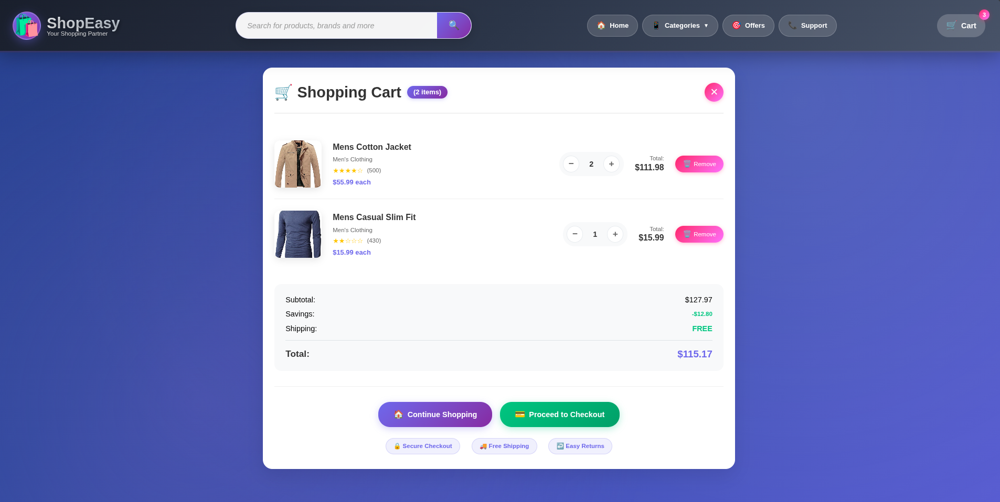

# 🛍️ ShopEasy — React E-commerce Website



## 📘 Overview

**ShopEasy** is a responsive and modern **E-commerce website** built with **React + Vite**.  
It allows users to browse, add, and manage products in their shopping cart — all in a sleek, interactive interface.  
This project focuses on smooth user experience, reusable UI components, and responsive design.

---

## 🌟 Features

- ✅ Clean and responsive UI  
- ✅ Browse products by category  
- ✅ Add and remove items from the cart  
- ✅ Dynamic cart total calculation  
- ✅ Modern gradient-based design  
- ✅ Fast build setup with Vite  
- ✅ Component-based React structure  

---

## 🖼️ Screenshots

### 🏠 Hero Section
A welcoming, stylish homepage introducing the ShopEasy experience.


---

### 🛍️ Product Page
Displays all available products with pricing, discounts, and “Add to Cart” functionality.



---

### 🛒 Cart Page
Summarizes added items, quantities, and total prices with checkout options.



---

## 🧩 Tech Stack

| Category | Technology |
|-----------|-------------|
| **Frontend** | React (Vite) |
| **Language** | JavaScript (ES6) |
| **Styling** | CSS / Tailwind CSS |
| **Package Manager** | npm |
| **Linting** | ESLint |

---

## ⚙️ Installation & Setup

Follow these steps to set up the project locally:

```bash
# Clone the repository
git clone https://github.com/PranjalNishad/ShopEasy---Ecommerce-website.git

# Navigate into the project
cd ShopEasy---Ecommerce-website

# Install dependencies
npm install

# Run the development server
npm run dev
